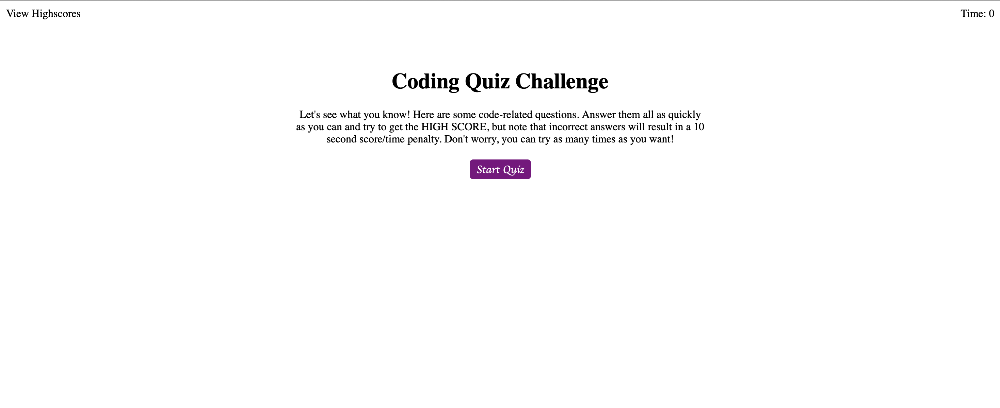
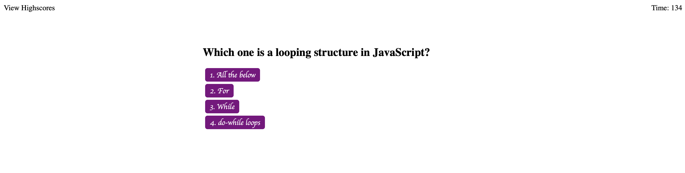
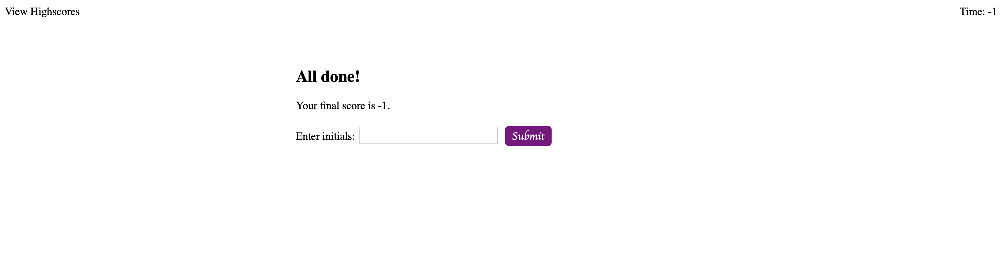

# Web_API_Code_Quiz

## Table of Contents
- [Project: Web APIs: Code Quiz](#project-web-apis-code-quiz)
  - [Table of Contents:](#table-of-contents)
  - [License:](#license)
  - [Description:](#description)
  - [Github:](#github)
  - [Images:](#images)

## License
https://github.com/Wasabi311/Web_API_Code_Quiz.git/License

## Description
Application Programming Interface to create dynamic, interactive web applications.

## Github
Github repository location at https://github.com/Wasabi311/Web_API_Code_Quiz.git

## Images

